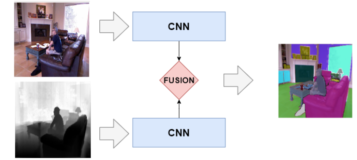

# Internship in Computer Vision : RGB-D Semantic Segmentation for Scene Understanding

## Context
We are looking for a research intern to work on computer vision research in University of Lille, Fox Team, CRIStAL. FoX Team works on information extraction from various visual inputs (images, videos, depth information, event-based sensors, ...). Our research directions include :
- Human behaviour understanding
- Facial emotion recognition
- Bio-inspired approaches for pattern recognition
- Object and scene understanding.

## Objectives
Semantic scene perception and understanding is a fundamental task for many modern applications (e.g. mobile robot navigation). To achieve such task, semantic segmentation acts as an initial step to many subsequent processes : person percepton, obstacle avoidance, semantic mapping, etc. Semantic Segmentation is the process of assigning each pixel of an image to a defined class. Similarly to many other computer vision tasks, deep learning approaches and convolutional neural networks (CNN) achieve state-of-the-art results in various semantic segmentation benchmarks, in spite of the high computational cost of such methods. However, many modern applications require real-time performance to be usable, which stresses the importance of designing efficient and accurate CNN models

On the other hand, the advent of low-cost depth sensors brought an additional input in addition to the common RBG image. Moreover, it has been shown that the additional geometric information brought by depth maps improve many vision tasks \[1\]. Applying both modalities for semantic segmentation is known as *RGB-D semantic segmentation*. Although many CNN-based approaches has been designed in recent years \[2\], they are mostly heavyweight models that are not suited for real-time inference on low-cost devices \[3\].

The objective of this internship is to collaborate with our researchers in FoX team towards novel RGB-D semantic segmentation approaches, with an interest towards efficient network design.

## Project Description
Based on the most popular benchmarks used in state-of-the-art, we currently work on designing new architectures to achieve real-time semantic segmentation with RGB-D images. Many other research works can be exploited to improve our results (self-supervised learning, transfer learning, ...). The intern will work on the application of these methods in our designed architectures, and will conduct experiments to validate our proposed approaches.

## Requirements
The candidate is expected to have great knowledge of computer vision and deep learning. In addition, good programming skills in python and deep learning frameworks (PyTorch and/or Tensorflow) are required. Experience on practical projects on computer vision is an asset. Finally, the candidate must have an interest to work in research activities.

## Contacts
- Chaabane DJERABA <chabane.djeraba@univ-lille.fr>
- José MENNESSON <jose.mennesson@univ-lille.fr>
- Sami BARCHID <sami.barchid@univ-lille.fr>

## References
1. Xiaofeng Ren, Liefeng Bo, and Dieter Fox. Rgb-(d) scenelabeling: Features and algorithms. In CVPR, 2012.
2. Fooladgar, F., & Kasaei, S. (2020). A survey on indoor RGB-D semantic segmentation: from hand-crafted features to deep convolutional neural networks. Multimedia Tools and Applications, 79(7), 4499-4524.
3. Seichter, D., Köhler, M., Lewandowski, B., Wengefeld, T., & Gross, H. M. (2020). Efficient RGB-D Semantic Segmentation for Indoor Scene Analysis. arXiv preprint arXiv:2011.06961.
